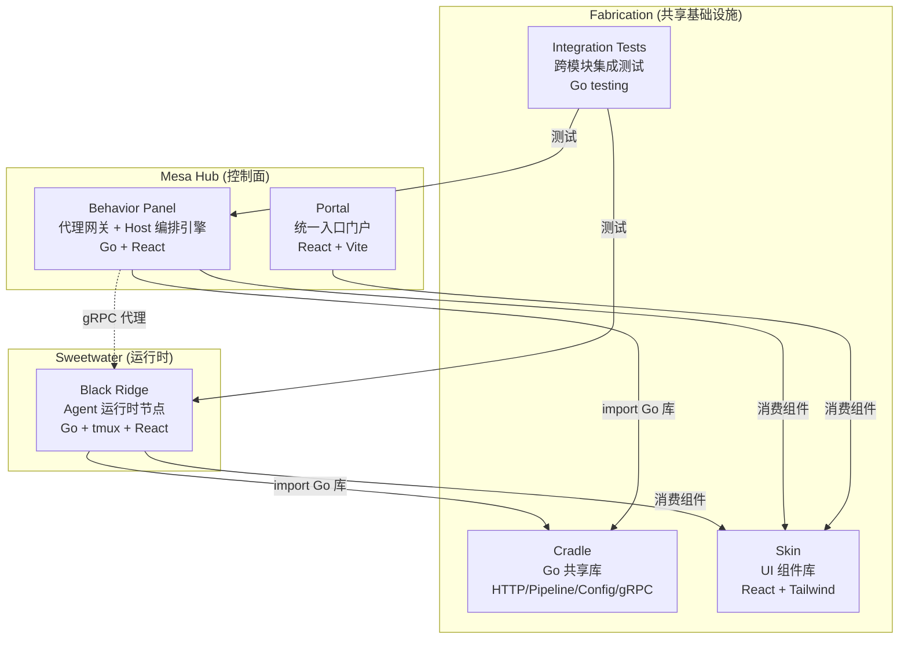
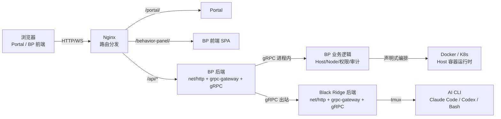
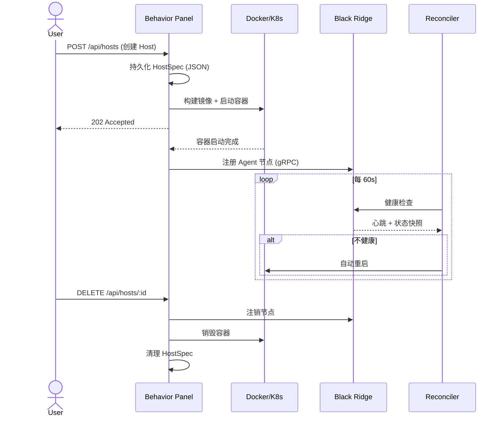
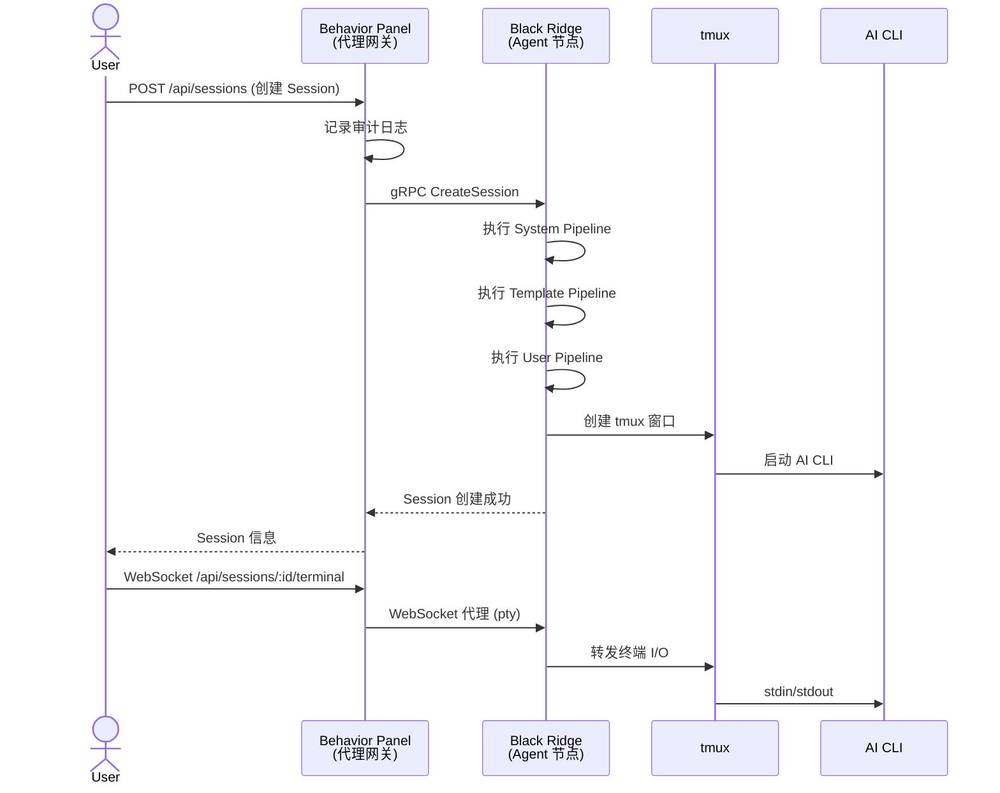

# The Maze 系统架构

## 模块依赖拓扑

---

## 请求路由全景

---

## Host 生命周期

---

## Session 创建代理流

---

## 模块职责一览

| 模块 | 职责 |
|------|------|
| Portal | 统一入口门户，西部世界主题 Landing → 主界面 |
| Behavior Panel | 代理网关 + Host 编排引擎，管控 Agent 节点全生命周期 |
| Black Ridge | Agent 运行时，tmux + Pipeline 管理 AI CLI 会话 |
| Cradle | Go 共享库，Proto IDL 驱动，提供 HTTP/Config/Auth/Pipeline |
| Skin | Westworld 主题 React 组件库，视觉特效 + Agent 业务组件 |
| Fabrication | 共享基础设施（Docker 构建模具 + K8s 部署清单） |
| Integration Tests | 跨模块集成测试，覆盖 Docker/K8s 双环境 |

## 外部依赖

| 依赖 | 用途 |
|------|------|
| PostgreSQL | Behavior Panel 权限系统持久化 |
| Docker | Host 容器运行时 + 镜像构建 |
| Kubernetes | 生产环境容器编排（可选） |
| tmux | Black Ridge Agent 节点的终端会话管理 |
| AI CLI 工具 | Claude Code、Codex 等（Agent 节点内运行） |
| buf | Protobuf IDL 代码生成 |
| Nginx | 前端路由分发 + API 反向代理 |
