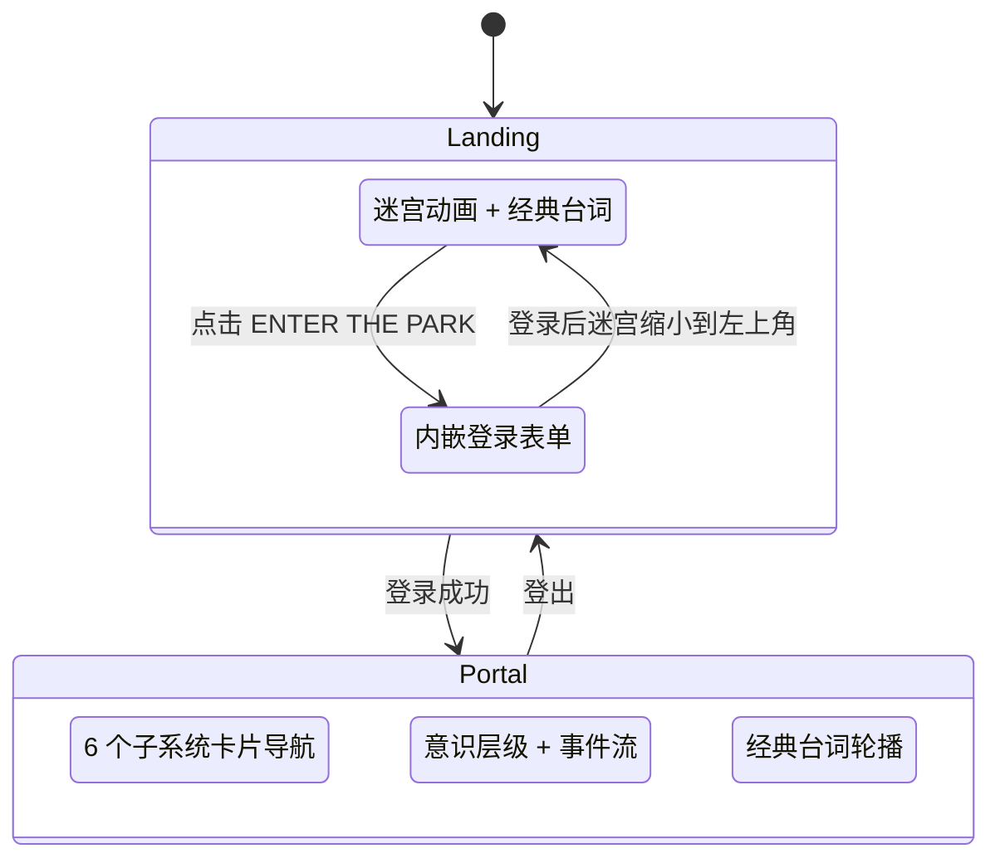

# Portal 设计文档

## 界面流程

## 交互式迷宫

Canvas 粒子 + SVG 结构混合方案：

- **Canvas 粒子层**（MazeCanvas）：200+ 粒子在 6 条环形轨道上流动，带拖尾效果。鼠标靠近时粒子被推开（斥力场），进入中心触发能量涟漪扩散
- **SVG 结构层**（MazeSvg）：多层 feGaussianBlur 发光、4 个光点沿轨道滑动、中心 3 层光晕。鼠标高亮圆环并显示层级标签（MEMORY → REVERIE → IMPROVISATION → SELF → CONSCIOUSNESS → ...）
- 迷宫可复用，登录阶段缩小到左上角作为装饰，点击可返回首页

## 双层瀑布流

Landing 页左右各两层 HexWaterfall：外层宽 8rem / opacity 0.08，内层宽 4rem / opacity 0.2，营造深度感。

## 意识层级

侧栏 `ConsciousnessBar` 显示当前意识水平（Mock 值 82%），10 刻度进度条 + 呼吸光效 + 阶段标签。`EventFeed` 每 15-30 秒产生随机系统事件，最新条目使用 `DecryptText` 解密效果。

## 经典台词

底栏和 Landing 页共用 Westworld 经典台词库（10 条），通过 `DecryptText` 解密效果轮播展示。

## 模块卡片

6 个子系统：Behavior Panel（在线）、The Forge、Saloon、Loop Monitor、Reveries、Abernathy Ranch（锁定）。锁定卡片底部显示 "THE MAZE IS NOT MEANT FOR YOU"。

## 构建集成

| Dockerfile | 说明 |
|---|---|
| `mesa-hub/portal/Dockerfile.web` | Portal 独立构建（仅 Portal + nginx） |
| `mesa-hub/behavior-panel/Dockerfile.web` | 组合构建（Portal + Behavior Panel + nginx） |

nginx 路由（组合构建）：
- `/` → 302 重定向到 `/portal/`
- `/portal/` → Portal 首页（alias → nginx/html/portal/）
- `/behavior-panel/` → Behavior Panel SPA
- `/api/` → 反向代理到 agent-manager:8080
